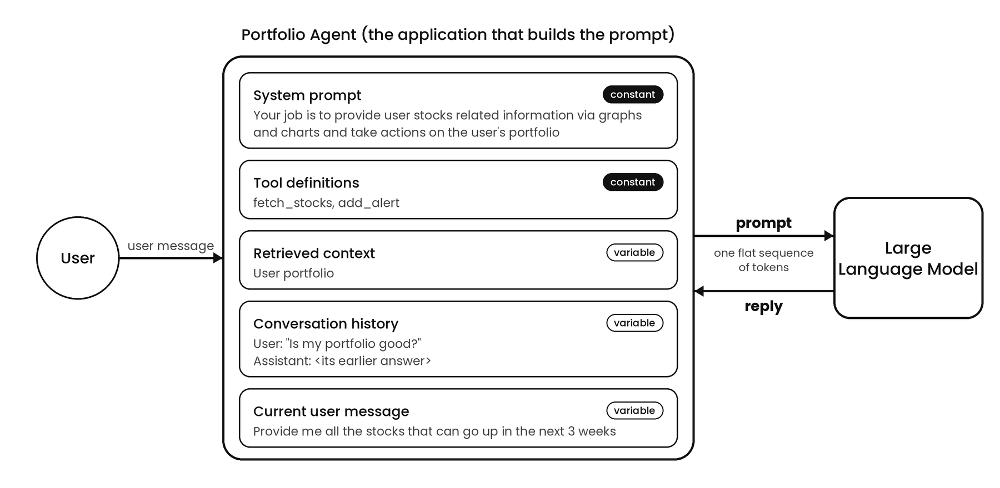

# Prompts

## What Is A Prompt?

A prompt is the full input a language model reads before the model starts generating a reply. A language model is a program trained to predict what text comes next. To see where the prompt fits, recall how the model produces text.

The model takes a sequence of tokens, the small chunks of text the model reads, usually whole words or pieces of words, and produces a probability for every possible next token. The system picks one token, adds the token to the end of the sequence, and runs the model again on the longer sequence. The loop repeats until the model produces a special token that means stop.

The prompt is the sequence handed to the model at the start of the loop, before the first predicted token is added. The reply is not part of the prompt. The reply is what the loop appends afterward.

In the simplest case, the prompt is just the text a person typed. In a real application, the prompt is almost never only the typed text.

## Is A Prompt Just The User's Message?

No, and the rest of this book leans on the distinction between the two. The user's message is one input to the prompt, not the prompt itself.

The distinction matters most when something goes wrong. When a model gives a bad answer, the cause is often in a part of the prompt the user never typed. Inspecting only the user's message hides most of the evidence.

## What Else Goes Into A Prompt?

A prompt has five components. In the table below, the developer is the person who writes the application, the program that builds the prompt and calls the model.

| Component | What the component is | Who writes the component | Constant or variable |
|---|---|---|---|
| System prompt | Standing instructions that set the model's behavior, tone, and rules | The developer | Constant |
| Tool definitions | Descriptions of the functions the model may ask for: a name, what the function does, and what inputs the function takes | The developer | Usually constant |
| Retrieved context | Information the application fetches from outside the conversation and inserts before the model call | The application's code | Variable |
| Conversation history | Every earlier user message and model reply in this conversation | Earlier turns | Variable |
| Current user message | The text the person just typed | The user | Variable |

Three notes on the table:

- **Constant means constant by convention.** The application holds the system prompt and tool definitions fixed from turn to turn. Nothing in the model enforces the convention.
- **History normally grows at the end.** But an application can rewrite the history by dropping or summarizing old messages, which changes the earlier part of the sequence.
- **Not every application uses all five components.** A bare call can be just the user's message. A production agent typically uses most of the five.



The model does not see five boxes. The application assembles the components, in an order the application chooses, into one flat sequence. A common order puts the constant components first, then the history, then the new message. Where retrieved context goes is a design choice.

## Where Does The Information Come From?

Three different routes put information into the sequence, and the routes differ in who decides to fetch the information.

| Route | Who supplies or fetches the information | Where the information lands | Example |
|---|---|---|---|
| User-supplied content | The user, along with their message | Inside the user message | A quarterly report the user uploads |
| Retrieved context | The application's code, before the model call | A component the application builds | The user's portfolio, loaded because they asked "is my portfolio good?" |
| Tool result | The model asks, and the application runs the tool and returns the output | Appended to the conversation | The result of a `fetch_stocks` request made mid-conversation |

Retrieved context, as this book uses the term, means information the application fetches from a source outside the conversation and inserts into the prompt before the model call, because the application expects the question to need the information. A tool result differs in who initiates: the model writes a request, and the application does the work. Tool results get their own treatment in the Tool Calling section.

Outside this book, "context" is often used loosely for all three routes. Here, retrieved context keeps the narrow meaning defined above.

## How Does The Model Tell Who Said What?

The application builds the prompt out of components, but the model reads one flat string. The prompt needs boundaries that mark where each speaker's turn starts and ends.

Marking those boundaries is the job of the provider, the company or service that runs the model and exposes the model over the internet, such as Anthropic, OpenAI, or Google. The developer's code talks to the provider through an API, the interface the provider publishes for sending requests. The provider's servers apply a chat template, a fixed formatting recipe that wraps each message in special tokens. Special tokens are reserved entries in the model's vocabulary that signal where a turn begins and ends. Special tokens are not ordinary text. Each model family has its own special tokens, and the API hides them from the developer.

Here is an illustration. The labels in angle brackets are invented for clarity, and real special tokens look different:

```
<system> You are a support assistant. </system>
<user> What's the capital of France? </user>
<assistant> Paris. </assistant>
<user> What's its population? </user>
<assistant>
```

Look at the last line. The sequence ends with an assistant special token that opens a turn and never closes the turn. The open turn is the cue for the model to write the assistant's reply. The reply is whatever the model produces after the open token, and the closing token is typically the stop signal that ends the loop.

These special tokens cover three roles: system, user, and assistant. A role is the label that says who is speaking. The model tells the roles apart by learned habit. During training, the period when the model learns from huge amounts of text, the model saw countless examples where text after the system token was treated as standing instructions, and the model learned to weight such text that way. The model's architecture does not enforce the weighting.

## What Does The Model Actually Know?

Less than the interface suggests. The model does not know that an application exists, or a database, or a person on the other end. The model never sees five components as separate things, only one string with special tokens in the string. The model cannot look anything up, run a function, or check who is talking. When the model appears to ask for a tool, the model is only writing text, and the application does the actual work.

The model does not know the components of the system. The model knows the string, and infers roles from the special tokens recognized during training.

## How Do You Mark Everything Else?

Only the three roles get special tokens. Retrieved context and other material have no special tokens of their own, so the material travels as ordinary text inside one of the role messages. Ordinary text creates a boundary problem.

Say a user types "Summarize our Q3 report in one sentence." The application searches the company's document storage, finds the report, and joins the strings in its prompt-building code. The model reads this string:

```
Summarize our Q3 report in one sentence. Quarterly revenue rose 12 percent, driven by the new pricing plan. Costs were flat. Keep it short.
```

Where does the document start, and where does the document end? Is "Keep it short" part of the document or another instruction? The text has three authors: the user wrote the request, the report's author wrote the document, and the developer wrote "Keep it short." The model sees none of the authorship. Roles tell the model who is speaking by position, not who wrote each sentence.

The fix is a delimiter, a visible boundary the developer writes into the text. XML-style tags, labels in angle brackets such as `<document>`, are a common choice. Headers and triple quotes also work.

```
<document>
Quarterly revenue rose 12 percent, driven by the new pricing plan. Costs were flat.
</document>
Summarize the document above in one sentence. Keep it short.
```

Roles and delimiters do similar jobs with different materials. The provider adds roles using special tokens. The developer adds delimiters using ordinary text. Because delimiters are ordinary text, delimiters work by learned habit too. The model has seen so much text where tags enclose a document that the model treats tags as a boundary.

The position of each piece matters as well, and the application decides the position. With long documents, putting the document before the question often works better than the reverse.

## What Can Go Wrong?

Delimiters work by habit, not enforcement, and the habit leaves a gap. Text inside the tags is still just text. A retrieved document could contain a sentence that reads like an instruction, and nothing hard stops the model from following the sentence. Hijacking a model this way is called prompt injection, and Part 5 covers prompt injection. Till the time the part is published, read this amazing article I have written on Medium about prompt injection : https://medium.com/gitconnected/prompt-injection-does-wrapping-an-email-in-tags-stop-an-attacker-b0df8432de1b


## What Comes Next?

The next section covers tokens: what tokens are, why the length of a prompt costs money and time, and why a token is not quite a word.